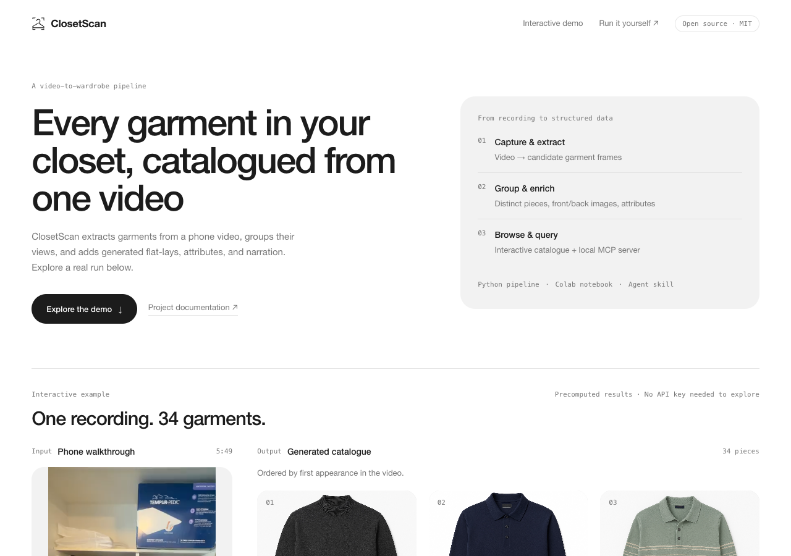
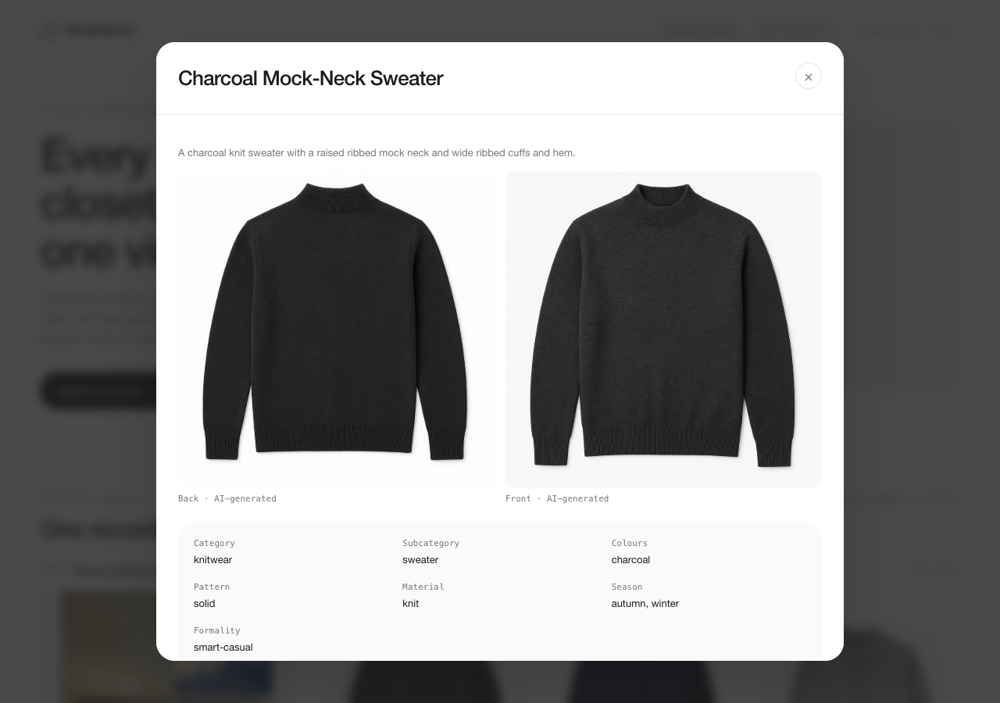

# ClosetScan

Turn a closet walkthrough video into a searchable wardrobe: source frames,
AI-generated front/back flat-lays, attributes, and optional narration.
Query the result with a local MCP server and the included wardrobe skill.

By Will Gao. A mention is appreciated, but not required. MIT licensed;
retain the copyright and license notice as required by MIT.



## See it first

**[Open the live demo](https://wgaostudio.github.io/closetscan-demo/)** —
one 5-minute-49-second phone recording beside the 34-garment catalogue built
from it. Nothing to install, no API key, no clone.

The demo is not part of this repository, so cloning stays small. To run it
offline, download `closetscan-demo.zip` from the
[latest release](https://github.com/wgaostudio/closetscan/releases/latest),
unzip it, and open `index.html`. Keep the folder together; the page loads its
images from `catalogue/`.



That catalogue was generated from the included recording using DINOv2 and the
paid AI stages; reruns can produce different results. It contains 34 garments
with 68 generated front/back images. Images marked as plates are generated
reconstructions; source frames remain available for comparison.

## One notebook: Colab or local Jupyter

[Open `closetscan_colab.ipynb` in Colab](https://colab.research.google.com/github/wgaostudio/closetscan/blob/main/closetscan_colab.ipynb).
The notebook installs the package and processes the demo video or one you
upload. The same notebook also runs in local Jupyter: open it from a clone, or
set `PROJECT_DIR` in its options cell. For a local custom video, set
`USE_DEMO=False` and `VIDEO_PATH`. Python 3.10+ and FFmpeg/ffprobe on PATH are
required locally.

With `USE_DEMO=True` the notebook downloads the demo walkthrough from the
release assets on first use and caches it in the workspace.

Extraction defaults to a local histogram method;
choose DINOv2 for learned embeddings. Enable the optional paid stages and supply
OpenRouter model IDs to create the complete catalogue. Every command stops on failure.

Video lives in the Colab runtime. Paid stages send images and optionally transcript
text to OpenRouter and its providers. Whisper transcribes within the runtime on CPU.
Costs and model availability vary; there is no fixed-cost promise.

The histogram default tests execution, not recognition quality. The notebook
checks its manifest, images, HTML, MCP query, and ZIP before export. Local
Jupyter prints the archive path; Colab downloads it.

## Local pipeline

Python 3.10+ and FFmpeg/ffprobe on PATH are required for video processing.
From a clone of this repository:

```bash
python3 -m venv .venv
source .venv/bin/activate
python -m pip install -e '.[pipeline,vision,narration]'
python -m closetscan.run path/to/walkthrough.mp4 --out out --embedder dinov2 --html
```

To use the same recording as the published demo, take `phone-walkthrough.mp4`
from `closetscan-demo.zip` in the
[latest release](https://github.com/wgaostudio/closetscan/releases/latest).

For extraction without model downloads, install `.[pipeline]` and use
`--embedder hist`. For a complete catalogue, set `OPENROUTER_API_KEY`,
`VISION_MODEL` (vision input + text output) and `IMAGE_MODEL` (image input +
text/image output) in your shell, then run:

```bash
python -m closetscan.dedup out --include-views --model "$VISION_MODEL"
python -m closetscan.product_shots out --model "$IMAGE_MODEL"
python -m closetscan.attributes out --model "$VISION_MODEL"
python -m closetscan.narration out --clip path/to/walkthrough.mp4 --model "$VISION_MODEL"
python -m closetscan.html_export out
```

Narration is optional and currently processes one clip per invocation; use one
walkthrough for the complete workflow. Individual stages can be rerun; retain
previous outputs before replacing them. Local key-file fallback is
`~/.config/openrouter/key`. Do not commit credentials or private catalogues.
The CLI retains the original experiment's model defaults; pass explicit model IDs
available to your account. See [OpenRouter multimodal documentation](https://openrouter.ai/docs/guides/overview/multimodal/overview).

## One MCP server + skill

The MCP server uses only Python's standard library. It opens no sockets and makes
no outbound requests. Install with `python -m pip install -e .`, or run from a
clone without installation, pointing it at any catalogue directory:

```bash
python -m closetscan.mcp_server out
```

To query the published demo instead, unzip `closetscan-demo.zip` and point the
server at its `catalogue` directory.

This waits for newline-delimited JSON-RPC on stdin; it is not an interactive CLI.
Use [mcp/config.example.json](mcp/config.example.json) in your MCP client's server
configuration, replacing both absolute paths. Install the package into the Python
environment named by `command`. Copy [skills/wardrobe](skills/wardrobe) into your
agent's skill directory. The skill uses the seven tools exposed by this server:

- `list_attributes`, `list_garments`, `get_garment`
- `search_garments`, `search_narration`
- `log_wear`, `get_wear_history`

The server supports MCP protocol `2024-11-05` over stdio and advertises that version
at initialization; clients must support it. See the [MCP transport specification](https://modelcontextprotocol.io/specification/2025-06-18/basic/transports).
Catalogue location: positional argument, then `CLOSETSCAN_CATALOGUE`, then `./out`.
Only `log_wear` writes, appending `wear_log.jsonl`. Back it up with its catalogue:
garment IDs can change when grouping is rerun. Search is lexical, not semantic.
`log_wear` requires a nonempty garment ID; invalid IDs never create or append
to the log. Corrupt or unreadable catalogue JSON raises an error. When
`dedup.json` is absent, the source-only candidate preview ignores existing
attributes, narration, and generated images because their grouping IDs
cannot safely be matched to candidate rows.
Image paths require local file access in the client. No pipeline tool is exposed.

## Limits and contributions

Capture can miss garments. Pause between items, hold still, and show both sides.
Generated images and attributes can invent details. Narration can be mistranscribed
or attached to the wrong item. Missing catalogue entries do not establish ownership,
and missing wear logs do not mean clothes were never worn.

Bug reports and pull requests are welcome. Include Python version, command,
and a small reproducible example; remove keys and personal data first.
Run `python -m unittest discover -s tests -v` before submitting code changes.
For the full suite install `.[pipeline]`; without it four tests skip. Tests read
the small catalogue in [tests/fixtures](tests/fixtures), not the published demo,
so they run on a fresh clone. CI runs the same checks on Python 3.10 and 3.12.

[MIT license](LICENSE) covers the project and the published demo to the extent the
author holds rights. Dependency and model licenses remain their own; visible brand
marks in the demo do not imply endorsement or grant trademark rights.
